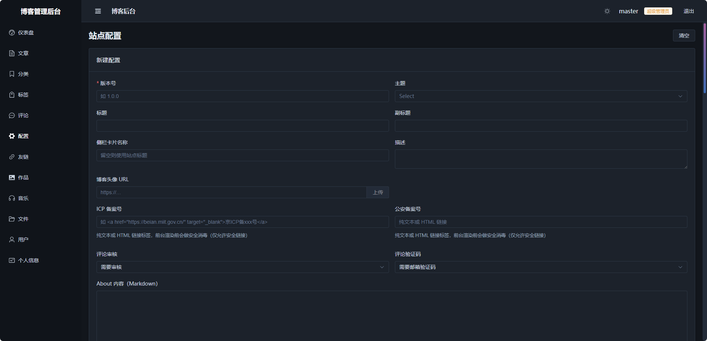

# 个人博客系统 - Gin + Vue

一个基于 **Go Gin** 和 **Vue 3** 开发的轻量级个人博客系统。

支持单用户管理、匿名评论审核、动态站点配置、Markdown 写作，适合作为个人技术博客或知识分享站点。

## 截图预览

| 首页（亮色） | 首页（暗色） | 后台 · 配置管理 |
| :---: | :---: | :---: |
|  |  |  |

## 功能特性

**前台**

- 文章列表、归档、分类、标签、站内搜索
- Markdown 渲染 + 代码高亮（markdown-it + highlight.js）
- 匿名评论，支持评论审核与邮箱验证码
- 友情链接、作品集、关于页
- 音乐播放器（APlayer）
- 亮色 / 暗色主题切换，支持自定义 CSS 变量
- SEO 优化：动态 `title` / `description`、sitemap、robots

**后台管理**

- 仪表盘统计、文章（Markdown 编辑器）、分类、标签
- 评论审核（通过 / 驳回 / 删除）
- 站点配置多版本管理，一键切换生效配置
- 友链、作品集、音乐、文件上传管理
- 用户管理（超级管理员）、个人资料与密码修改

**安全与工程**

- JWT 双 Token（access + refresh），bcrypt 密码加密
- XSS 过滤、登录防爆破限流、验证码 IP 限流、安全响应头
- 可信反向代理配置（正确获取真实客户端 IP）
- 定时数据库备份（CSV 导出 + zip 压缩）
- 数据库支持 SQLite / MySQL / PostgreSQL，缓存支持 Memory / Redis
- 文件存储支持本地 / S3 兼容对象存储（MinIO、阿里云 OSS、七牛等）
- 生产环境强制校验 JWT 密钥强度，拒绝弱密钥启动

## 技术栈

| 层 | 技术 |
| --- | --- |
| 后端 | Go 1.25 · Gin · GORM · Viper · Zap · golang-jwt · gocron |
| 存储 | SQLite / MySQL / PostgreSQL · Redis / Memory · Local / S3 |
| 前端 | Vue 3 · TypeScript · Vite · Pinia · Vue Router · Element Plus |
| 编辑器/渲染 | md-editor-v3 · markdown-it · highlight.js · DOMPurify |
| 其他 | Axios · APlayer · VueUse · Vitest |

## 项目结构

```
myblog
├── backend                  # Go 后端服务
│   ├── cmd/faker            # 假数据生成工具
│   ├── internal
│   │   ├── app              # 应用初始化、配置、数据库迁移
│   │   ├── dto              # 请求/响应数据传输对象
│   │   ├── handler          # HTTP 处理器
│   │   ├── middleware       # JWT 认证、CORS、限流、安全头等中间件
│   │   ├── model            # GORM 数据模型
│   │   ├── router           # 路由注册
│   │   └── service          # 业务逻辑层
│   ├── pkg                  # 可复用包
│   │   ├── cache            # Memory / Redis 缓存
│   │   ├── captcha          # 验证码（邮件 / 开发环境）
│   │   ├── config           # 配置加载（viper）
│   │   ├── database         # 数据库连接（SQLite/MySQL/PostgreSQL）
│   │   ├── email            # SMTP 邮件
│   │   ├── jwt              # JWT 签发与校验
│   │   ├── logger           # Zap 日志（支持轮转）
│   │   ├── response         # 统一响应与分页
│   │   ├── scheduler        # 定时任务
│   │   ├── storage          # 文件存储（local / oss）
│   │   ├── utils            # 通用工具
│   │   ├── validate         # 自定义校验器
│   │   └── xss              # XSS 过滤
│   ├── static               # 邮件模板、上传文件
│   ├── config-example.yaml  # 配置样例（复制为 config.yaml 使用）
│   └── main.go              # 程序入口
├── frontend                 # Vue 3 前端
│   ├── src
│   │   ├── api              # 接口封装
│   │   ├── components       # 通用组件
│   │   ├── composables      # 组合式函数
│   │   ├── router           # 路由与守卫
│   │   ├── stores           # Pinia 状态
│   │   ├── types            # 类型声明
│   │   ├── utils            # 工具函数
│   │   └── views            # 页面（前台 + 后台）
│   ├── vite.config.ts       # Vite 配置（含开发代理）
│   └── package.json
├── imgs                     # README 截图
└── .github                  # CI/CD 工作流
```

## 快速开始

### 环境要求

- Go 1.25+
- Node.js 22.18+ 或 24.12+
- 可选：Redis、MySQL / PostgreSQL（默认使用 SQLite + 内存缓存，零外部依赖即可启动）

### 1. 启动后端

```bash
cd backend
# 复制配置样例（首次运行）
cp config-example.yaml config.yaml   # Windows: copy config-example.yaml config.yaml
# 按需修改 config.yaml（未提供的配置项会自动使用合理默认值）
go run main.go
```

服务默认监听 `http://127.0.0.1:8090`。

> 首次启动会自动执行数据库迁移，并根据 `user` 配置创建超级管理员账户。

### 2. 启动前端

```bash
cd frontend
npm install
npm run dev
```

开发环境已将 `/api` 与 `/uploads` 请求代理到 `http://127.0.0.1:8090`，可通过环境变量 `VITE_API_PROXY_TARGET` 覆盖。

### 3. （可选）生成假数据

```bash
cd backend
go run ./cmd/faker
```

自动填充分类、标签、文章、评论、友链、作品集及站点配置，方便快速预览效果。

## 配置说明

核心配置项位于 `backend/config-example.yaml`，支持通过环境变量覆盖（前缀 `BLOG`，如 `BLOG_SERVER_PORT=8080`）。常用配置：

| 配置项 | 说明 |
| --- | --- |
| `server` | 监听地址、端口、可信反向代理 |
| `app.env` | 运行环境 `development` / `production`（生产环境强制校验 JWT 密钥强度） |
| `db.driver` | 数据库驱动：`sqlite` / `mysql` / `postgres` |
| `cache.driver` | 缓存驱动：`memory` / `redis` |
| `storage.type` | 文件存储：`local` / `oss`（S3 兼容） |
| `captcha.option` | 验证码发送方式：`email` / `sms`（短信暂未实现） |
| `email` | SMTP 邮件配置（验证码、评论通知、错误告警） |
| `user` | 管理员初始化账户（用户名、密码、邮箱等） |
| `backup` | 数据库定时备份（启用、cron 表达式、保存目录） |
| `cors.origins` | 跨域白名单（留空表示不开放跨域） |

## 测试

```bash
# 后端单元测试
cd backend && go test ./...

# 前端单元测试
cd frontend && npm run test:unit

# 前端类型检查 / 构建
cd frontend && npm run build
```

## 部署

### 手动部署

```bash
# 1. 构建前端
cd frontend && npm install && npm run build   # 产物在 frontend/dist

# 2. 构建后端（按目标平台交叉编译）
cd backend
GOOS=linux  GOARCH=amd64 go build -o blog-server-linux-amd64
GOOS=windows GOARCH=amd64 go build -o blog-server-windows-amd64.exe

# 3. 运行后端，并将 frontend/dist 交由 nginx 等静态服务器托管
```

## 许可证

[MIT](./LICENSE) © Tian
